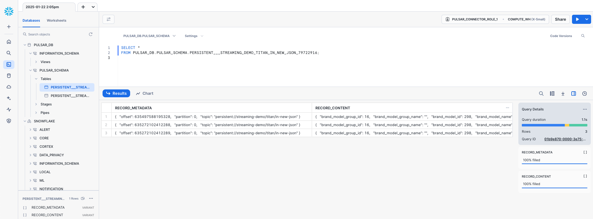

# WebSocket to JSON Pulsar Function

This project implements a **Pulsar Function** to process messages received from a WebSocket producer and publish them to specific Pulsar topics based on the event type. It utilizes **Astra Streaming** for messaging and includes support for Dead Letter Queues (DLQ) to handle unknown or invalid event types.

The motivation behind this project is to address the requirement of many sinks, such as the Snowflake sink, which require messages to adhere to a schema (e.g., JSON). In contrast, messages produced by a WebSocket client are typically schemaless. This function subscribes to the topic where the WebSocket client sends its data, transforms the messages into a JSON schema, and publishes them to a topic that the Snowflake sink subscribes to for ingesting data into Snowflake.



---

## **Features**

- **Event-Based Routing**:
  - Routes messages to different Pulsar topics based on the `event_name` field in the payload.
  - Example events: `new_register`, `other_event`.

- **Dead Letter Queue**:
  - Unrecognized or invalid events are sent to a Dead Letter Queue (DLQ) for further investigation.

- **Schema Validation**:
  - Ensures messages conform to a predefined JSON schema (`NewRegisterMessageSchema`).

- **Configurable Setup**:
  - Uses dynamic configurations (e.g., topics, Pulsar service URL, and authentication token) provided at runtime.

---

## **Requirements**

1. Python 3.7+
2. Pulsar Client Library:
   ```bash
   pip install pulsar-client
   ```
3. Astra Streaming Account (or Apache Pulsar 3.3.2 setup).

---

## **Configuration**

### **1. Function Configuration**
The function is configured using a YAML file for the Pulsar CLI. Below is an example:

```yaml
tenant: streaming-demo
namespace: titan
name: websocket-json-function
py: /path/to/your/websocket-json-function.py
className: websocket-json-function.WebSocketToJsonFunction
parallelism: 1
inputs:
 - persistent://streaming-demo/titan/device
autoAck: true
logTopic: persistent://streaming-demo/titan/log
userConfig:
  logging_level: INFO
  service_url: pulsar+ssl://pulsar-gcp-uscentral1.streaming.datastax.com:6651
  auth_token: YOUR_AUTH_TOKEN
  new_register_topic: persistent://streaming-demo/titan/in-new-json
  other_topic: persistent://streaming-demo/titan/in-other-json
  dead_letter_topic: persistent://streaming-demo/titan/dead-letter
```

### **2. Set Up Astra Streaming**
Before setting up Astra Streaming, ensure you have [**Apache Pulsar 3.3.2**](https://archive.apache.org/dist/pulsar/pulsar-3.3.2/apache-pulsar-3.3.2-bin.tar.gz) installed and configured in the root of this project.

1. **Download `client.conf`**:
   - Log in to your Astra Streaming dashboard and download the `client.conf` file.
   - Place the file in the `conf` directory of your local `apache-pulsar-3.3.2` installation.

2. **Create Topics**:
   - Navigate to the `apache-pulsar-3.3.2` directory and run the following commands:
     ```bash
     bin/pulsar-admin topics create "persistent://streaming-demo/titan/device"
     bin/pulsar-admin topics create "persistent://streaming-demo/titan/in-new-json"
     bin/pulsar-admin topics create "persistent://streaming-demo/titan/in-other-json"
     bin/pulsar-admin topics create "persistent://streaming-demo/titan/dead-letter"
     bin/pulsar-admin topics create "persistent://streaming-demo/titan/log"
     ```

3. **Deploy the Function**:
   - Use the `create-config.yaml` file to deploy the function:
     ```bash
     bin/pulsar-admin functions create --function-config-file create-config.yaml
     ```

---

## **Pulsar Function Details**

### **WebSocket to JSON Function**
- **Purpose**: 
  - Processes incoming WebSocket messages, validates their schema, and routes them to the appropriate topic.
  - Unrecognized events are sent to the Dead Letter Queue.

- **Input**: 
  - Topic: `persistent://streaming-demo/titan/device`

- **Outputs**:
  - `new_register_topic`: Processes messages with `event_name` = `new_register`.
  - `other_topic`: Processes messages with `event_name` = `other_event`.
  - `dead_letter_topic`: Captures messages with unrecognized or missing `event_name`.

- **Schema**:
  - The function uses the following schema for message validation:
    ```json
    {
      "type": "record",
      "name": "NewRegisterMessageSchema",
      "fields": [
        { "name": "event_name", "type": ["null", "string"] },
        { "name": "id", "type": ["null", "int"] },
        { "name": "serial_number", "type": ["null", "string"] },
        { "name": "ethernet_mac_address", "type": ["null", "string"] },
        { "name": "wifi_mac_address", "type": ["null", "string"] },
        { "name": "device_uuid", "type": ["null", "string"] },
        { "name": "brand_model_id", "type": ["null", "int"] },
        { "name": "market_id", "type": ["null", "int"] },
        { "name": "external_id", "type": ["null", "string"] },
        { "name": "consumer_id", "type": ["null", "string"] },
        { "name": "firmware", "type": ["null", "string"] },
        { "name": "for_test", "type": ["null", "boolean"] },
        { "name": "brand_model_name", "type": ["null", "string"] },
        { "name": "market_code", "type": ["null", "string"] },
        { "name": "country", "type": ["null", "string"] },
        { "name": "brand_model_group_id", "type": ["null", "int"] },
        { "name": "brand_model_group_name", "type": ["null", "string"] }
      ]
    }
    ```

---

## **Logging and Monitoring**

- All logs are published to `persistent://streaming-demo/titan/log`.
- Use the following command to monitor logs:
  ```bash
  bin/pulsar-client consume -s log-reader persistent://streaming-demo/titan/log
  ```

---

## **Testing the Function**

To test the function, you can use the included `websocket-send.py` script to send a sample message to the input topic.

### **1. Setup**
Ensure the following Python dependencies are installed:
```bash
pip install websocket-client
```

### **2. Send a Test Message**
Run the `websocket-send.py` script to send a test message to the `persistent://streaming-demo/titan/device` topic:
```bash
python websocket-send.py
```

### **3. Script Details**
The `websocket-send.py` script sends a sample message with the following payload:
```json
{
    "event_name": "new-register",
    "id": 4426,
    "serial_number": "tw1234xxxx",
    "ethernet_mac_address": "94:b8:66:xx:xx:xx",
    "wifi_mac_address": "c4:8b:66:xx:xx:xx",
    "device_uuid": "70971ba5-4be8-xxxx-xxxx-xxxxxxxxxxxx",
    "brand_model_id": 298,
    "market_id": 2,
    "external_id": null,
    "consumer_id": "916251xxxx",
    "firmware": "056.002.028.000",
    "for_test": false,
    "brand_model_name": "43PUSxxxx",
    "market_code": "es",
    "country": "GB",
    "brand_model_group_id": 16,
    "brand_model_group_name": ""
}
```

### **4. Verify Output**
The function processes the message and routes it to one of the following topics:
- **`new_register_topic`**: If the `event_name` is `new-register`.
- **`other_topic`**: If the `event_name` matches `other-event`.
- **`dead_letter_topic`**: For unrecognized `event_name` values.

Use the following commands to consume messages from the respective topics:

#### **Consume from `new_register_topic`**:
```bash
bin/pulsar-client consume -s test-reader persistent://streaming-demo/titan/in-new-json
```

#### **Consume from `dead_letter_topic`**:
```bash
bin/pulsar-client consume -s test-reader persistent://streaming-demo/titan/dead-letter
```
